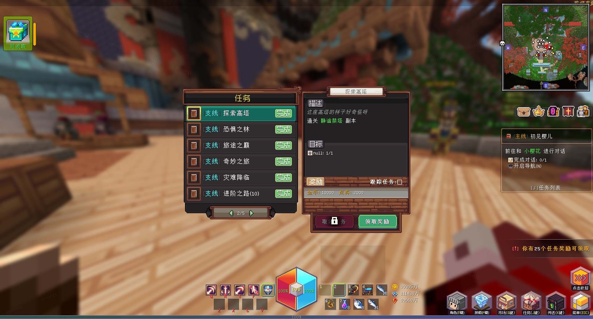
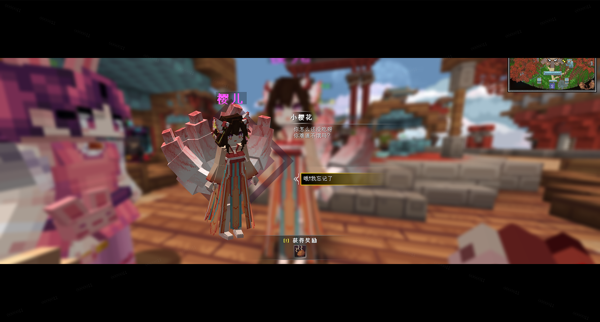

# JustQuest

> 任务系统




#### API
`JustQuestAPI`

```yaml
# 分配指定任务给玩家
JustQuestAPI.allotQuest(Player player, String id)
```

#### Event
```yaml
# 玩家任务账户加载完成事件
QuestAccountLoadEvent
# 跑环任务条件交付事件
ChainQuestSubmitEvent
# 开启对话事件
ConversationEvent.Enter
# 离开对话事件
ConversationEvent.Leave
# 对话完成事件
ConversationEvent.Complete
# 每轮对话触发内容事件
ConversationEvent.Contents
# 玩家触发对话选项事件
ConversationEvent.Option
```